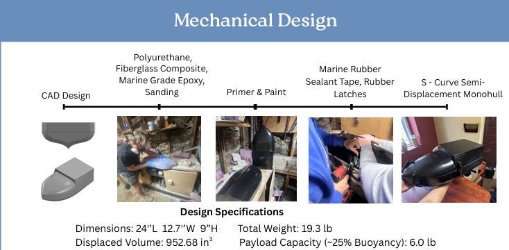
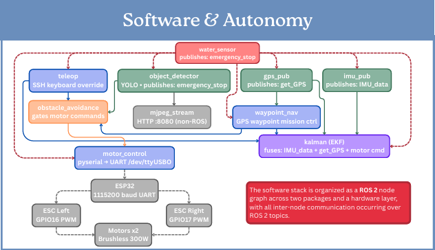
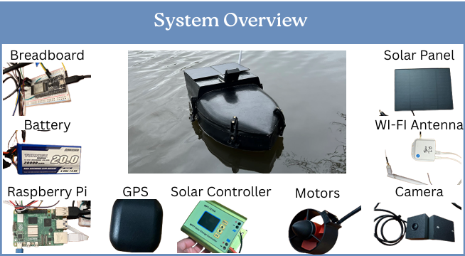

# Autonomous Surface Vessel for Near-Shore Emergency Naval Delivery

## 📌 Executive Summary
Coastal disasters frequently compromise critical infrastructure like ports, roads, and docks, leaving life-saving relief supplies stranded offshore. To bridge this critical logistics gap, this Major Qualifying Project (MQP) details the design, fabrication, and validation of a solar-assisted, fully autonomous monohull surface vessel engineered to execute repeated emergency payload deliveries within shallow coastal or debris-laden pond environments. 

The platform leverages differential-thrust maneuverability, a robust mechatronic power framework, and a modular ROS 2 autonomy stack to navigate complex pathways autonomously without human operator intervention.

---

## 📐 Mechanical Platform & Structural Specifications
The hull features an optimized **S-Curve Semi-Displacement Monohull** topology designed to maximize hydrodynamic stability under full payload limits while minimizing drag profile resistance. 

| Design Parameter | Specification Metric |
| :--- | :--- |
| **Physical Dimensions** | 24.0" L  x  12.7" W  x  9.0" H |
| **Total Operational Weight** | 19.3 lbs |
| **Emergency Payload Capacity** | 6.0 lbs (~25% Total Buoyancy limit) |
| **Volumetric Displacement** | 952.68 in³ |
| **Maximum Buoyant Support** | 34.4 lbs (Reserve Buoyancy: 15.1 lbs) |
| **Structural Materials** | Polyurethane, Fiberglass Composite, Marine Grade Epoxy |
| **Waterproofing Systems** | Marine Rubber Sealant Tape, High-Tension Rubber Latches |

  

  <em>Figure 1: Parametric 3D CAD layout of the semi-displacement monohull and component configuration.</em>

---

## ⚡ Power & Electrical Architecture
The vessel manages power distribution through a primary energy system supplemented by solar harvesting arrays to extend operational mission lifetimes:
* **Primary Propulsion Power:** 14.8V Lithium-Polymer (LiPo) battery pack managed by an integrated 30A Battery Management System (BMS) with a 40A MAXI safety fuse.
* **Solar-Assisted Charging:** Two 12V marine-grade solar panels routed through an MPT-7210A step-up boost controller.
* **Actuation System:** Dual 300W brushless marine motors driven by independent 20A Electronic Speed Controllers (ESCs), generating differential thrust for zero-turn maneuvering capabilities.
* **Logic Voltage Regulation:** An efficient 5V DC-DC buck converter to supply clean, regulated power to the central single-board computer.

---

## 🧠 Software Stack & Autonomy Architecture
The autonomy framework is built as a distributed **ROS 2 node graph** spread across a high-level processing core (Raspberry Pi 5) and a hardware abstraction controller (ESP32 via 115200 baud UART). 

  

  <em>Figure 2: ROS 2 node architecture tracking communication topics across localization, safety overrides, and motor controllers.</em>

### Core Nodes & Sensor Fusion:
* **Localization:** An Extended Kalman Filter (EKF) fuses state estimation metrics from a 9-DOF IMU (`imu_pub`) and GPS module (`gps_pub`).
* **Mission Control (`waypoint_nav`):** Directs automated outer-loop GPS waypoint path-tracking routines.
* **Computer Vision Safety System:** Leverages a custom **YOLO Object Detector** running via camera stream to flag obstacles and publish safety triggers (`emergency_stop`) alongside an internal bilge/water ingress sensor.

---

## 📊 Empirical Field Validation & Testing Results
The vessel was validated through rigorous step-by-step physical testing protocols:

* **Leak Testing:** 30-second full submersion and splash diagnostics yielded **zero internal water ingress**, confirming structural seal reliability.
* **Flotation & Hydrodynamic Stability:** Assessed under a full 6.0 lb payload; confirmed positive buoyancy, acceptable trim limits, and stable center-of-gravity profiles.
* **Maneuvering & Propulsion:** Confirmed twin 300W thrusters successfully overcome hydrodynamic drag, demonstrating precise differential-thrust turning in open water.
* **Autonomous Navigation:** Successfully executed an outdoor **100-meter GPS waypoint mission**, navigating autonomously to arrive within 3 meters of the coordinate target.

  

  <em>Figure 3: Empirical testing and validation trials analyzing buoyancy, navigation accuracy, and mechatronic subsystems under active water loads.</em>

---

## 📂 Project Assets & Documentation
The complete, unedited academic deliverables detailing full kinematic derivations, fluid simulations, and assembly logs can be reviewed below:

* 📄 **[Read the Full Technical MQP Report (PDF)](documents/Final_MQP_Technical_Report.pdf)**
* 🖼️ **[View the High-Resolution Project Poster (PDF)](documents/MQP_Project_Poster.pdf)**
